# gmall
谷粒商品商城项目

## 1.创建github远程代码仓库

ssh：

git@github.com:hh2134/gmall.git

https：

https://github.com/hh2134/gmall.git

## 2.创建gmall项目

- 创建一个用来装项目的文件夹，在github中

- 创建一个 *new repository* 

- 在 *Repository name* 中输入项目的名称

- 在 *Description* 中输入项目的描述

- 点击 *Public* 共享项目

- 点击 *Add a README file* 添加一个README文件

- 点击 *.gitignore template:None* 选择Java

- 点击 *License:None* 选择许可证（Apache License 2.0）

- 点击 *Create repository* 创建项目

- 配置github密钥

  ```
  --初始化项目
  git init
  --查看文件在工作区、暂存区、本地仓库
  git status
  --将文件添加到暂存区，"."表示当前目录下的所有文件
  git add .
  --将暂存区的文件提交到本地仓库
  git commit -m "描述信息"
  --将本地仓库的文件提交到远程仓库
  git push
  ```

将 **gmall-admin** 和 **gmall-common** 复制到 **gmall** 项目中

添加忽略 **gmall/.gitignore**

```
.idea/
target/
*.iml
mvnw*
.mvn/


# Compiled class file
*.class

# Log file
*.log

# BlueJ files
*.ctxt

# Mobile Tools for Java (J2ME)
.mtj.tmp/

# Package Files #
*.jar
*.war
*.nar
*.ear
*.zip
*.tar.gz
*.rar

# virtual machine crash logs, see http://www.java.com/en/download/help/error_hotspot.xml
hs_err_pid*

```

## 3.框架

基础框架

SSM redis mysql rabbitmq
web启动器：Spring SpringMVC
MP启动器：mybatis mybatis-plus
mysql驱动
redis启动器

架构依赖

springboot springCloud
nacos-discovery启动器
nacos-config启动器
sentinel启动器
feign启动器
zipkin启动器
gateway启动器

## 4.搭建5个ms

gmall-pms：谷粒商城商品管理系统

添加依赖：

- Spring Web
- MySQL Driver
- Spring Data Redis(Access+Driver)
- Zipkin
- OpenFign

gmall-ums：谷粒商城用户管理系统

添加依赖：

- Spring Web
- MySQL Driver
- Spring Data Redis(Access+Driver)
- OpenFign

gmall-oms：谷粒商城订单管理系统

添加依赖：

- Spring Web
- MySQL Driver
- Spring Data Redis(Access+Driver)
- OpenFign

gmall-wms：谷粒商城仓储管理系统

添加依赖：

- Spring Web
- MySQL Driver
- Spring Data Redis(Access+Driver)
- OpenFign

gmall-sms：谷粒商城营销管理系统

添加依赖：

- Spring Web
- MySQL Driver
- Spring Data Redis(Access+Driver)
- OpenFign

## 5.启动的服务

Nacos启动，在bin目录下cmd，运行 `startup.cmd -m standalone` 访问地址 `localhost:8848/nacos` 登陆账户 `nacos` 密码 `nacos` 

sentinel启动，在根目录下cmd，运行 `java -jar sentinel-dashboard-1.8.2.jar` 

zipkin启动，在根目录下cmd，运行 `java -jar zipkin-server-2.20.2-exec.jar`

Mysql启动，在虚拟机启动mysql8.0版本的mysql，运行 `systemctl start mysqld` 访问链接 `192.168.44.100` 端口 `3306` 登陆账号 `root` 密码 `MySQL8.0.32` 远程连接后，导入sql文件

Tomcat启动，在虚拟机启动apache-tomcat-7.0.70，运行 `/software/apache-tomcat-7.0.70/bin/shutdown.sh` 访问地址 `192.168.44.100:8080`

Nginx启动，在虚拟机进入 `/usr/local/nginx/sbin` 目录,执行 `./nginx`，版本Nginx-1.12.2访问地址 `192.168.44.100:80`

node启动，在node目录中启动cmd，输入 `node server.js`，版本Node-v12.15.0

## 6.搭建pms工程

1. 依赖问题：pom.xml

   以自己的父工程作为父工程

   删除 `properties` 标签

   修改依赖 `mysql-connector-j` 改为 `mysql-connector-java`

   手动引入依赖

   - gmall-common依赖：

     `gmall-common`

   - mybatis-plus启动器：

     `mybatis-plus-boot-starter`

   - nacos-discovery启动器：

     `spring-cloud-starter-alibaba-nacos-discovery`

   - nacos-config启动器：

     `spring-cloud-starter-alibaba-nacos-config`

   - sentinel启动器：

     `spring-cloud-starter-alibaba-sentinel`

   - zipkin启动器：

     `spring-cloud-starter-zipkin`

2. 配置文件

删除 **gmall-pms/src/main/resources/application.properties**

新建 **gmall-pms/src/main/resources/application.yml**

application.yml

```yaml
server:
# 配置该服务的端口号
  port: 18081
spring:
  cloud:
    nacos:
      discovery:
        server-addr: localhost:8848
    sentinel:
      transport:
#       sentinel的连接地址
        dashboard: localhost:8080
        port: 8719
  zipkin:
#   zipkin的连接地址
    base-url: http://localhost:9411
    discovery-client-enabled: false
    sender:
      type: web
  sleuth:
    sampler:
#     采集率设置为1，指100%
      probability: 1
# 配置数据源
  datasource:
    driver-class-name: com.mysql.cj.jdbc.Driver
    url: jdbc:mysql://192.168.44.100:3306/guli_pms
    username: root
    password: MySQL8.0.32
# redis连接
  redis:
    host: 192.168.44.100
    port: 6379
#feign哨兵启动
feign:
  sentinel:
#   开启
    enabled: true
mybatis-plus:
# mybatis-plus的写sql语句的xml地址
  mapper-locations: classpath:mapper/pms/**/*.xml
# 别名扫描配置包路径
  type-aliases-package: com.atguigu.gmall.pms.entity
  global-config:
    db-config:
#     配置mybatis-plus的id策略默认是分布式ID自动自增
      id-type: auto
```

新建 **gmall-pms/src/main/resources/bootstrap.yml**

bootstrap.yml

```yaml
spring:
  application:
    name: pms-service
  cloud:
    nacos:
      config:
#       nacos的连接地址
        server-addr: localhost:8848
#       登陆nacos，在命名空间中新建，命名空间名称：pms，描述：谷粒商城商品管理系统，复制所生成的命名空间ID
#       nacos的pms的命名空间ID
        namespace: d6a420a1-e34e-4980-aec3-1b8afa451bd8
#       分组：dev
        group: dev
#       文件扩展名：yml格式
        file-extension: yml
```

## 7.在pms启动类上添加注解

**gmall-pms/src/main/java/com/atguigu/gmall/pms/GmallPmsApplication.java**

GmallPmsApplication.java

```java
package com.atguigu.gmall.pms;

import org.mybatis.spring.annotation.MapperScan;
import org.springframework.boot.SpringApplication;
import org.springframework.boot.autoconfigure.SpringBootApplication;
import org.springframework.cloud.client.discovery.EnableDiscoveryClient;
import org.springframework.cloud.openfeign.EnableFeignClients;
import springfox.documentation.swagger2.annotations.EnableSwagger2;

/*
* @SpringBootApplication    来标注一个主程序类，说明这是一个Spring Boot应用
* @EnableDiscoveryClient    注解是一个Spring Boot的注解，主要是用于发现 Eureka 注册中心的服务，它可以把当前应用注册到 Eureka Server，从而使服务消费者能够找到
* @EnableFeignClients       启动feign客户端
* @EnableSwagger2           是Springfox提供的一个注解，代表swagger2相关技术开启，会扫描当前类所在包，及子包中所有类型的swagger相关注解，做swagger文档定制
* @MapperScan               指定要变成实现类的接口所在的包，然后包下面的所有接口在编译后都会生成相应的实体类
 * */
@SpringBootApplication
@EnableDiscoveryClient
@EnableFeignClients
@EnableSwagger2
@MapperScan("com.atguigu.gmall.pms.mapper")
public class GmallPmsApplication {

    public static void main(String[] args) {
        SpringApplication.run(GmallPmsApplication.class, args);
    }

}

```

## 8.使用逆向工程生成代码

将逆向工程 **gmall-generator** 复制到项目中

修改 **gmall-generator/src/main/resources/application.yml**

```yaml
# 原代码
spring:
  datasource:
    type: com.alibaba.druid.pool.DruidDataSource
    #MySQL配置
    driverClassName: com.mysql.cj.jdbc.Driver
    url: jdbc:mysql://172.16.116.100:3306/guli_oms?useUnicode=true&characterEncoding=UTF-8&useSSL=false
    username: root
    password: root

# 修改后
# mysql
spring:
  datasource:
    type: com.alibaba.druid.pool.DruidDataSource
    #MySQL配置
    driverClassName: com.mysql.cj.jdbc.Driver
#    修改远程连接mysql的ip，修改guli_oms改成需要生成代码的数据库名
    url: jdbc:mysql://192.168.44.100:3306/guli_pms?useUnicode=true&characterEncoding=UTF-8&useSSL=false
    username: root
#    修改远程mysql的密码
    password: MySQL8.0.32
```

修改 **gmall-generator/src/main/resources/generator.properties**

```yaml
#修改前
mainPath=com.atguigu
#\u5305\u540D
package=com.atguigu.gmall
moduleName=oms
#\u4F5C\u8005
author=eyvren
#Email
email=eyvren@atguigu.com
#\u8868\u524D\u7F00(\u7C7B\u540D\u4E0D\u4F1A\u5305\u542B\u8868\u524D\u7F00)
tablePrefix=oms_

# 修改后
mainPath=com.atguigu
#包名
package=com.atguigu.gmall
#修改成需要生成代码的数据库名
moduleName=pms
#作者
author=eyvren
#Email
email=eyvren@atguigu.com
#mysql表前缀（类名不会包含前缀）
#修改成需要生成代码的数据库名前缀
tablePrefix=pms_
```

启动逆向工程，访问连接 `localhost:80` 全选->生成代码（会自动下载）

将生成的代码

- **guli\main\java\com\atguigu\gmall\pms** 下的包复制到 **gmall-pms/src/main/java/com/atguigu/gmall/pms** 包下

- **guli\main\resources** 下的 **mapper** 包复制到 **gmall-pms/src/main/resources** 包下

## 9.测试连接gmall-pms

启动 **GmallPmsApplication** 访问地址 `http://localhost:18081/pms/brand` 

显示

```json
{
    "code": 0,
    "msg": null,
    "data": {
        "pageSize": 10,
        "pageNum": 1,
        "total": 0,
        "totalPage": 0,
        "list": [
            {
                "id": 1,
                "name": "尚硅谷",
                "logo": "http://www.atguigu.com/images/pic_new/logo.png",
                "status": 1,
                "firstLetter": "S",
                "sort": 1,
                "remark": null
            },
            {
                "id": 2,
                "name": "华为",
                "logo": "http://www-file.huawei.com/-/media/corporate/images/home/logo/huawei_logo.png",
                "status": 1,
                "firstLetter": "H",
                "sort": 2,
                "remark": null
            },
            {
                "id": 3,
                "name": "小米",
                "logo": "http://s02.mifile.cn/assets/static/image/mi-logo.png",
                "status": 1,
                "firstLetter": "X",
                "sort": 3,
                "remark": null
            }
        ]
    }
}
```

其中 `"total": 0,` 总记录数应该为3， `"totalPage": 0,` 总页数应该为1

在 **gmall-pms/src/main/java/com/atguigu/gmall/pms/config** 写入mybatis-plus分页插件，直接从官方文档中copy

MybatisPlusConfig.java

```java
package com.atguigu.gmall.pms.config;

import com.baomidou.mybatisplus.annotation.DbType;
import com.baomidou.mybatisplus.extension.plugins.MybatisPlusInterceptor;
import com.baomidou.mybatisplus.extension.plugins.inner.PaginationInnerInterceptor;
import org.mybatis.spring.annotation.MapperScan;
import org.springframework.context.annotation.Bean;
import org.springframework.context.annotation.Configuration;

@Configuration
@MapperScan("scan.your.mapper.package")
public class MybatisPlusConfig {

    /**
     * 新的分页插件,一缓和二缓遵循mybatis的规则,需要设置 MybatisConfiguration#useDeprecatedExecutor = false 避免缓存出现问题(该属性会在旧插件移除后一同移除)
     */
    @Bean
    public MybatisPlusInterceptor mybatisPlusInterceptor() {
        MybatisPlusInterceptor interceptor = new MybatisPlusInterceptor();
        interceptor.addInnerInterceptor(new PaginationInnerInterceptor(DbType.H2));
        return interceptor;
    }

}
```

再次运行，显示正确 `"total": 3,` 总记录数为3， `"totalPage": 1,` 总页数为1

## 10.搭建sms工程

1. gmall-sms/pom.xml

2. 将 `spring-boot-starter-parent` 改成父类依赖 `gmall`

3. 删除 `properties` 标签

4. 引入 `gmall-common` 依赖

5. 引入 `mybatis-plus-boot-starter` 启动器

6. 引入 `spring-cloud-starter-alibaba-nacos-discovery` 依赖

7. 引入 `spring-cloud-starter-alibaba-nacos-config` 依赖

8. 引入 `spring-cloud-starter-alibaba-sentinel` 依赖

9. 引入 `spring-cloud-starter-zipkin` 依赖

10. 将 `mysql-connector-j` 依赖改成 `mysql-connector-java` 依赖，`com.mysql` 改成 `mysql`

11. 删除 `dependencyManagement` 标签

12. 删除 **gmall-sms/src/main/resources/application.properties** 文件

13. 新建 **gmall-sms/src/main/resources/application.yml**

    application.yml

    ```yaml
    server:
      port: 18082
    spring:
      cloud:
        nacos:
          discovery:
            server-addr: localhost:8848
        sentinel:
          transport:
            dashboard: localhost:8080
    #       端口号被占用的情况下，会自动递增
            port: 8719
      zipkin:
        base-url: http://localhost:9411
        discovery-client-enabled: false
        sender:
          type: web
      sleuth:
        sampler:
          probability: 1
      datasource:
        driver-class-name: com.mysql.cj.jdbc.Driver
        url: jdbc:mysql://192.168.44.100:3306/guli_sms
        username: root
        password: MySQL8.0.32
      redis:
        host: 192.168.44.100
        port: 6379
    feign:
      sentinel:
        enabled: true
    mybatis-plus:
      mapper-locations: classpath:mapper/sms/**/*.xml
      type-aliases-package: com.atguigu.gmall.sms.entity
      global-config:
        db-config:
          id-type: auto
    ```

14. 新建 **gmall-sms/src/main/resources/bootstrap.yml**

    bootstrap.yml

    ```yaml
    spring:
      application:
        name: sms-service
      cloud:
        nacos:
          config:
            server-addr: localhost:8848
    #       nacos新建sms命名空间
            namespace: 3d468a45-2c49-4fb4-ba07-dd965353f326
            group: dev
            file-extension: yml
    ```

15. 将pms中的分页插件 **gmall-pms/src/main/java/com/atguigu/gmall/pms/config/MybatisPlusConfig.java** 复制到 **gmall-sms/src/main/java/com/atguigu/gmall/sms** 中

16. 给启动类 **gmall-sms/src/main/java/com/atguigu/gmall/sms/GmallSmsApplication.java** 添加注解

    ```java
    @EnableDiscoveryClient
    @EnableFeignClients
    @EnableSwagger2
    @MapperScan("com.atguigu.gmall.sms.mapper")
    ```

17. 使用逆向工程生成 `gmall-sms` 代码

    修改配置文件

    ```yaml
    # 文件application.yml
    url: jdbc:mysql://192.168.44.100:3306/guli_pms?useUnicode=true&characterEncoding=UTF-8&useSSL=false
    # 改成
    url: jdbc:mysql://192.168.44.100:3306/guli_sms?useUnicode=true&characterEncoding=UTF-8&useSSL=false
    
    # 文件generator.properties
    ...
    moduleName=pms
    ...
    tablePrefix=pms_
    # 改成
    ...
    moduleName=sms
    ...
    tablePrefix=sms_
    ```

    将生成的代码

    - **guli\main\java\com\atguigu\gmall\sms** 下的包复制到 **gmall-sms/src/main/java/com/atguigu/gmall/sms** 包下

    - **guli\main\resources** 下的 **mapper** 包复制到 **gmall-sms/src/main/resources** 包下

18. 测试连接启动 **GmallSmsApplication** 

    `http://localhost:18082/sms/skubounds`

## 11.搭建网关工程

gmall-gateway：谷粒商城网关系统

添加依赖：

- Gateway

1. 将 `spring-boot-starter-parent` 改成父类依赖 `gmall`

2. 删除 `properties` 标签

3. 引入 `spring-cloud-starter-alibaba-nacos-discovery` 依赖

4. 引入 `spring-cloud-starter-alibaba-nacos-config` 依赖

5. 删除 `dependencyManagement` 标签

6. 删除 **gmall-gateway/src/main/resources/application.properties** 文件

7. 新建 **gmall-sms/src/main/resources/application.yml**

   application.yml

   ```yaml
   server:
     port: 8888
   spring:
     cloud:
       nacos:
         discovery:
           server-addr: localhost:8848
       gateway:
         routes:
           - id: pms-route
             uri: lb://pms-service
             predicates:
               - Path=/pms/**
           - id: sms-route
             uri: lb://sms-service
             predicates:
               - Path=/sms/**
           - id: oms-route
             uri: lb://oms-service
             predicates:
               - Path=/oms/**
           - id: wms-route
             uri: lb://wms-service
             predicates:
               - Path=/wms/**
           - id: ums-route
             uri: lb://ums-service
             predicates:
               - Path=/ums/**
   ```

8. 新建 **gmall-sms/src/main/resources/bootstrap.yml**

   bootstrap.yml

   ```yaml
   spring:
     application:
       name: gateway-api
     cloud:
       nacos:
         config:
           server-addr: localhost:8848
   #       在nacos中新建命名空间
           namespace: 49950b7f-310c-47e9-a82d-554a1d218a28
           group: dev
           file-extension: yml
   ```

9. 测试连接启动 **GmallGatewayApplication** & **GmallSmsApplication**

   `http://localhost:8888/sms/skubounds`

## 12.通过nginx解决端口问题

1. 在 **C:\Windows\System32\drivers\etc** 目录下配置 **hosts**

   hosts

   ```
   192.168.44.100 api.gmall.com manager.gmall.com www.gmall.com
   ```

2. 在物理机获取ip，按win+r键，输入 `cmd`，执行 `ipconfig` 

   ```
   以太网适配器 VMware Network Adapter VMnet1:
   
      连接特定的 DNS 后缀 . . . . . . . :
      本地链接 IPv6 地址. . . . . . . . : fe80::4c94:7d21:d476:15a3%16
      IPv4 地址 . . . . . . . . . . . . : 192.168.12.1
      子网掩码  . . . . . . . . . . . . : 255.255.255.0
   ```

   获取到VMware Network Adapter VMnet1的IPv4地址

   `192.168.12.1`

   VMware Network Adapter VMnet1的ip不易发生改变，其他的IPv4会因为连接的网络不同而发生改变

3. 进入虚拟机，在 **/usr/local/nginx/conf** 目录下，修改 **nginx.conf** 

   nginx.conf

   ```
   worker_processes  1;
   events {
       worker_connections  1024;
   }
   
   
   http {
       include       mime.types;
       default_type  application/octet-stream;
       sendfile        on;
       keepalive_timeout  65;
   
       server {
           listen       80;
           server_name  api.gmall.com;
           location / {
               proxy_pass http://192.168.12.1:8888;
           }
           
       }
   
       server{
           listen       80;
           server_name  manager.gmall.com;
           location / {
               proxy_pass http://192.168.12.1:1000;
           }
       }
   }
   ```

流程

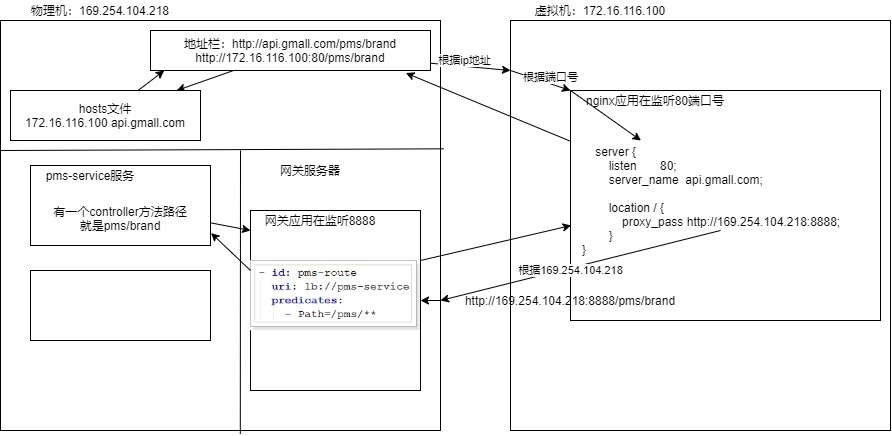

## 13.前后联调

1. 启动前端工程gmall-admin，中的 **前端工程/gmall-admin**

2. 在 **前端工程/gmall-admin** 目录中，输入cmd，输入 `npm start`

   测试连接：

   `localhost:1000`

3. 修改 **gmall-admin/src/main/resources/application.yml** 中redis的连接配置

4. 修改 **gmall-admin/src/main/resources/application-dev.yml** 中mysql的连接配置及连接账户和密码

5. 启动后端工程gmall-admin，项目中的 **gmall/gmall-admin**，启动 **GmallAdminApplication**

   测试连接：

   `localhost:1000`

   账户：admin密码：admin

## 14.跨域问题

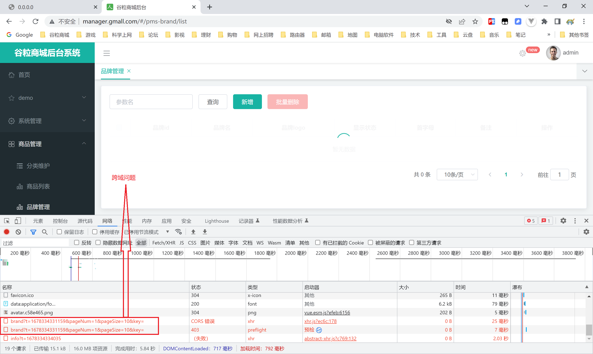

访问品牌管理失败

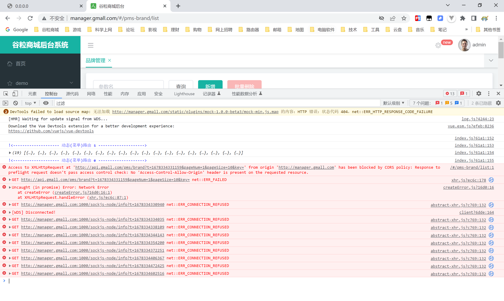

从连接“http://manager.gmall.com”访问“http://api.gmall.com/pms/brand?t=1678334331159&pageNum=1&pageSize=10&key=”的XMLHttpRequest已被CORS策略阻止:对预检请求的响应没有通过访问控制检查:所请求的资源上没有'Access- control - allow - origin '标头。

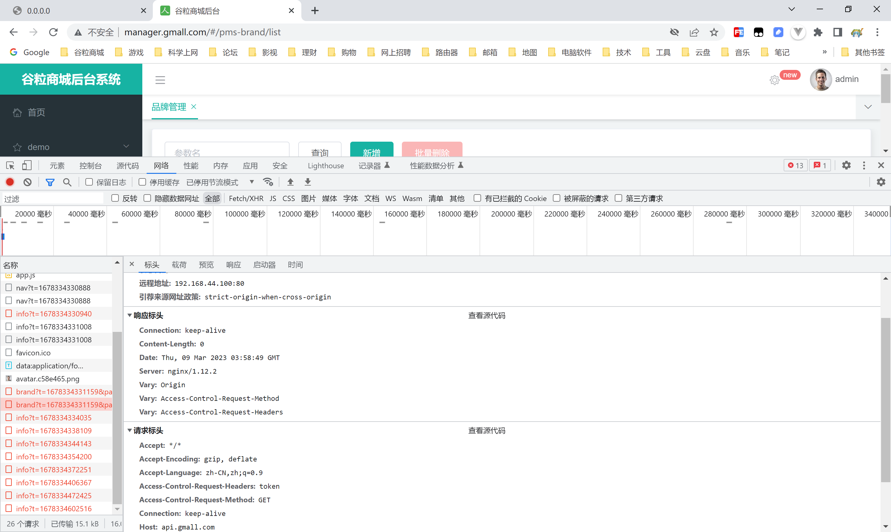

跨域：浏览器的同源策略导致的 

http://api.gmall.com:10010/pms/brand

1. 协议不同：http https
2. 二级域名不同：api.gmall.com manager.gmall.com
3. 一级域名不同：gmall.com jd.com tmall.com
4. 端口号不同：10010 10086

> 路径不同不属于跨域

跨域并不总是有跨域问题，跨域问题是浏览器针对ajax请求的一种限制

解决方案

1. jsonp：把动态数据伪装成静态资源以骗过浏览器
   1. 只能解决get请求的跨域问题
   2. 前后端开发人员的密切配合

2. nginx：反向代理为同一个域名

3. cors规范：w3c提供的解决规范，需要服务器端配置白名单（域名 请求方式 头信息 是否可用携带cooke）

   原理：两次请求

   - 一次预检请求：
     - 请求方法：OPTIONS
     - 只有预检请求通过，才会发送真正的请求
     - 响应标头失败
       - Access-Control-Request-Headers: token
       - Access-Control-Request-Method: GET
       - Origin: http://manager.gmall.com
     - 响应标头成功
       - Access-Control-Allow-Credentials: true
       - Access-Control-Allow-Headers: token
       - Access-Control-Allow-Methods: GET,POST,PUT,DELETE,OPTIONS
       - Access-Control-Allow-Origin: http://manager.gmall.com
       - Access-Control-Max-Age: 3600

   - 一次真正请求

玩法：制作白名单

1. nginx：通过cors实现跨域，配置 **nginx.conf**，将

   ```
   add_header Access-Control-Allow-Origin '*';  
   add_header Access-Control-Allow-Credentials "true";
   add_header Access-Control-Allow-Methods 'GET, POST, OPTIONS';
   add_header Access-Control-Allow-Headers  'token,DNT,X-Mx-ReqToken,Keep-Alive,User-Agent,XRequested-With';
   ```

   放入server{}中

   缺点：违背了devops思想

2. 网关配置：在 **application.yml** 配置 `spring.cloud.gateway.globalcors.cors-cofigurations`

   

   需要新建Map<K,V>

   K存这类：Access-Control-Allow-Credentials

   V存这类：true

   缺点：语义不明

3. 网关通过过滤器：

   CorsWebFilter（适用与gateway）

   CorsFilter（适用于zuul）

4. 注解：@CrossOrigin

## 15.解决跨域问题

使用网关过滤器 `CorsWebFilter` 解决跨域问题

在 **gmall-gateway/src/main/java/com/example/gmall/gateway/config** 新建 **CorsConfig.java** 

CorsConfig.java

```java
package com.example.gmall.gateway.config;

import org.springframework.context.annotation.Bean;
import org.springframework.context.annotation.Configuration;
import org.springframework.web.cors.CorsConfiguration;
import org.springframework.web.cors.reactive.CorsWebFilter;
import org.springframework.web.cors.reactive.UrlBasedCorsConfigurationSource;

/**
 * @ClassName CorsConfig
 * @Author 鳄鱼魜
 * @Date 2023/3/9 15:21
 * @Version 1.0
 * @Description 使用过滤器 CorsWebFilter 解决跨域问题
 */

@Configuration
public class CorsConfig {

    @Bean
    public CorsWebFilter corsWebFilter(){
        CorsConfiguration corsConfiguration = new CorsConfiguration();
        // 允许跨域访问的域名，”*“代表所有域名，不建议使用”*“，因为不安全，不能携带cookie
        corsConfiguration.addAllowedOrigin("http://manager.gmall.com");
        corsConfiguration.addAllowedOrigin("http://localhsot:1000");
        // 允许跨域访问的请求方式，可以写“get”，“post”，建议写"*"，因为“*”代表任何请求方式
        corsConfiguration.addAllowedMethod("*");
        // 是否允许携带cookie，允许
        corsConfiguration.setAllowCredentials(true);
        // 允许跨域访问的头信息，“*”表示任意访问
        corsConfiguration.addAllowedHeader("*");
        UrlBasedCorsConfigurationSource urlBasedCorsConfigurationSource = new UrlBasedCorsConfigurationSource();
        urlBasedCorsConfigurationSource.registerCorsConfiguration("/**",corsConfiguration);
        return new CorsWebFilter(urlBasedCorsConfigurationSource);
    }

}
```

启动服务

`GmallGatewayApplication`

`GmallPmsApplication`

`GmallAdminApplication`

测试连接：

http://manager.gmall.com/

查看

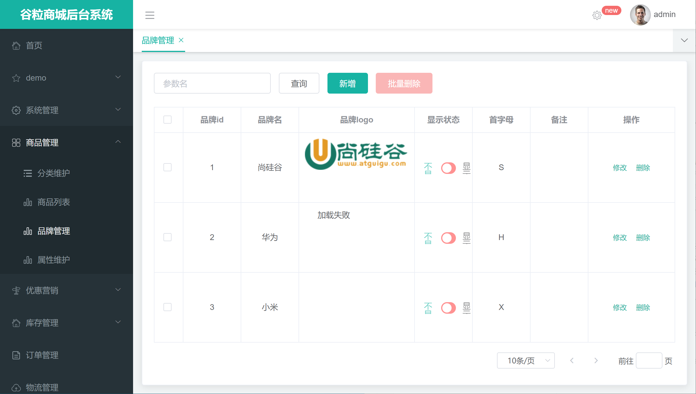

## 16.图片上传

1. 用aliyun的oss来存储图片

   使用文档 https://help.aliyun.com/document_detail/31927.html 

2. 进入aliyun的OSS控制台

   https://oss.console.aliyun.com/overview

   bucket列表

   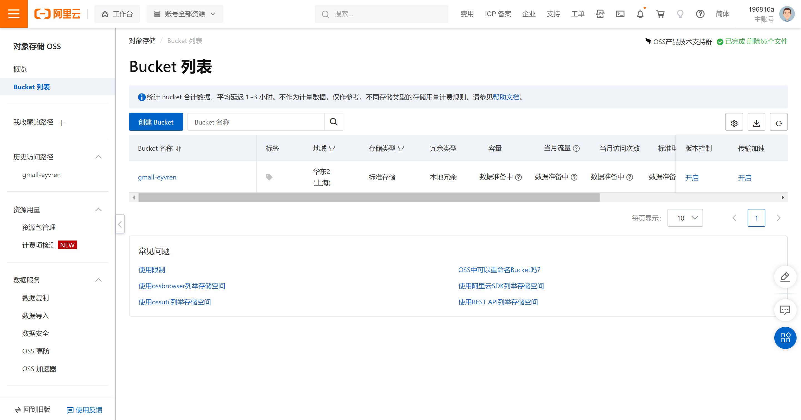

   创建bucket（选择低频访问存储，公共读）

   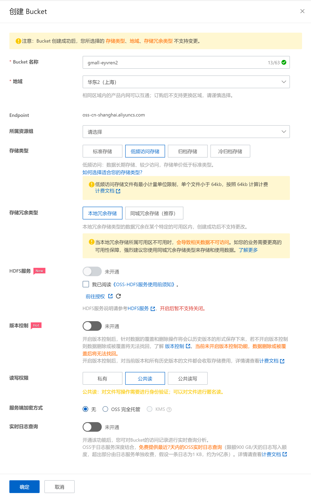

   跨域设置规则

   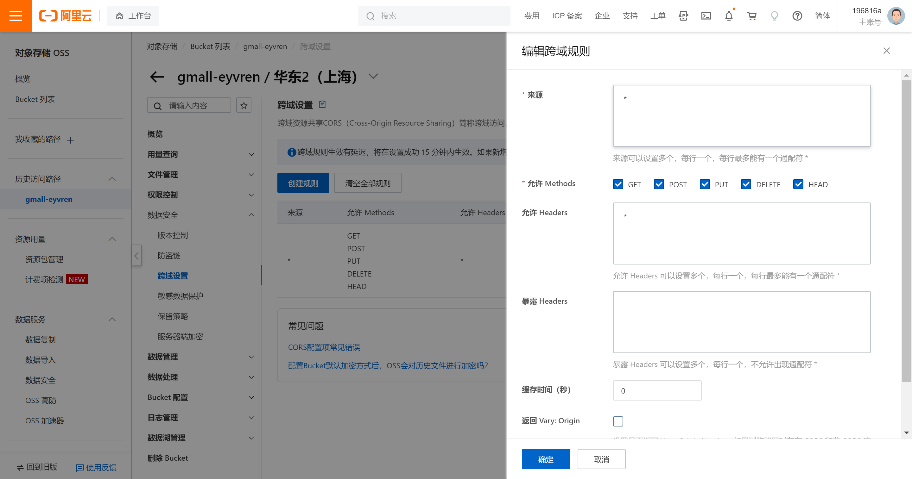

3. 查看上传图片的请求网址

   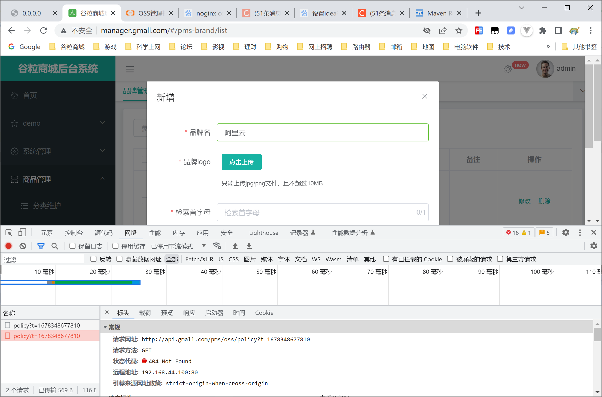

   可以看出上传图片的请求网址是 http://api.gmall.com/pms/oss/policy?t=1678348677810

   请求路径是 **api.gmall.com/pms/oss/policy**

   **?t=1678348677810** 这个是防止浏览器缓存的随机值

4. 创建密钥

   AccessKey管理

   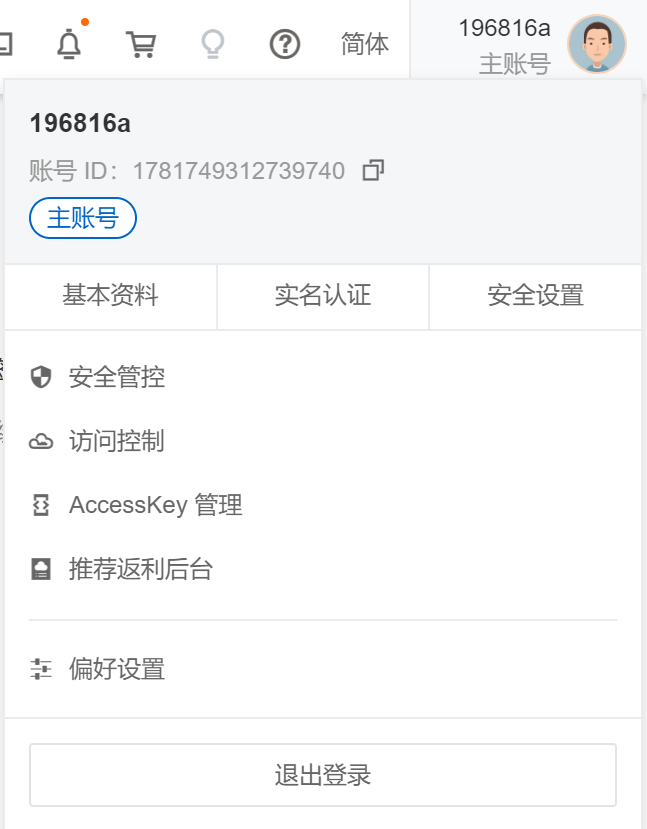

   使用子用户 -> 创建用户

   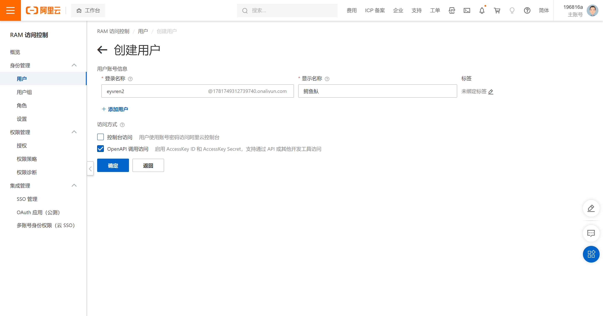

   用户

   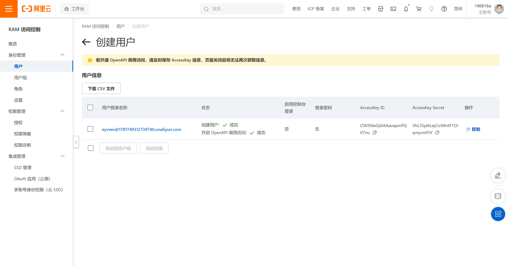

   获取到 

   AccessKey ID：`LTAI5tFCfUQy2JgwZTkbH9ea`

   AccessKey Secret：`iseWdd6lMZMpbvtsUdsuYKPWXJyrk4`

   添加权限（AliyunOSSFullAccess：表示所有权限）

   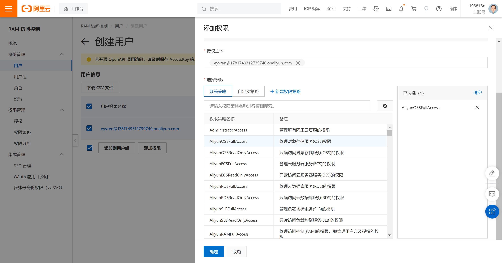

5. gmall-eyvren -> 概述 -> 外网访问

   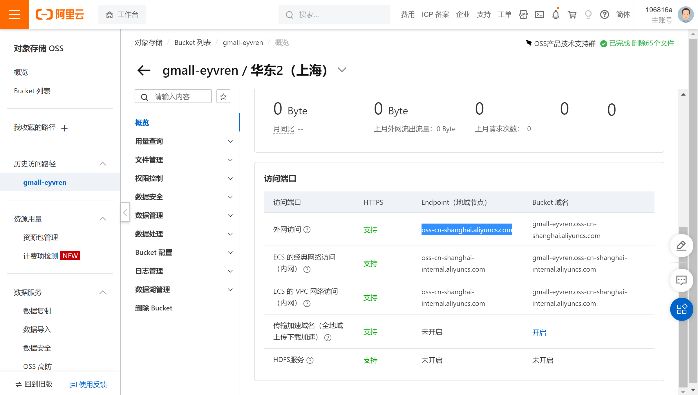

   获取到地域节点： `oss-cn-shanghai.aliyuncs.com`

6. bucket列表 -> bucket名称 -> 复制 gmall-eyvren

   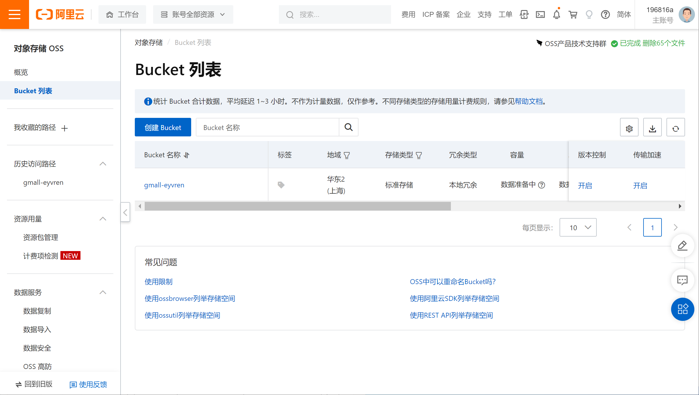

   获取到bucket名称：`gmall-eyvren`

7. 需要的参数

   ```java
   // 代码直接 copy 官方文档
   String accessId = "AccessKey ID";
   String accessKey = "AccessKey Secret";
   String endpoint = "地域节点";
   String bucket = "bucket名称";
   ```

8. 在 **gmall-pms/src/main/java/com/atguigu/gmall/pms/controller** 目录下新建 **OssController.java**

   OssController.java

   ```java
   package com.atguigu.gmall.pms.controller;
   
   import com.aliyun.oss.OSS;
   import com.aliyun.oss.OSSClientBuilder;
   import com.aliyun.oss.common.utils.BinaryUtil;
   import com.aliyun.oss.model.MatchMode;
   import com.aliyun.oss.model.PolicyConditions;
   import com.atguigu.gmall.common.bean.ResponseVo;
   import org.apache.commons.net.ftp.FTP;
   import org.apache.commons.net.ftp.FTPClient;
   import org.springframework.web.bind.annotation.GetMapping;
   import org.springframework.web.bind.annotation.RequestMapping;
   import org.springframework.web.bind.annotation.RestController;
   
   import java.io.File;
   import java.io.FileInputStream;
   import java.io.IOException;
   import java.text.SimpleDateFormat;
   import java.util.Date;
   import java.util.LinkedHashMap;
   import java.util.Map;
   
   /**
    * @ClassName OssController
    * @Author 鳄鱼魜
    * @Date 2023/3/9 16:58
    * @Version 1.0
    * @Description 图片上传到阿里云OSS
    */
   
   @RestController
   @RequestMapping("pms/oss")
   public class OssController {
   
       @GetMapping("policy")
       public ResponseVo<Object> queryObjectBy() {
           // 阿里云账号AccessKey拥有所有API的访问权限，风险很高。强烈建议您创建并使用RAM用户进行API访问或日常运维，请登录RAM控制台创建RAM用户。
           String accessId = "LTAI5tFCfUQy2JgwZTkbH9ea";
           String accessKey = "iseWdd6lMZMpbvtsUdsuYKPWXJyrk4";
           // Endpoint以华东1（杭州）为例，其它Region请按实际情况填写。
           String endpoint = "oss-cn-shanghai.aliyuncs.com";
           // 填写Bucket名称，例如examplebucket。
           String bucket = "gmall-eyvren";
           // 填写Host地址，格式为https://bucketname.endpoint。
           String host = "https://" + bucket + "." + endpoint;
           // 设置上传到OSS文件的前缀，可置空此项。置空后，文件将上传至Bucket的根目录下。
           Date date = new Date();
           // 以 yyyy-MM-dd 名称方式创建文件夹来存储
           String dir = new SimpleDateFormat("yyyy-MM-dd").format(date);
   
           // 创建ossClient实例。
           OSS ossClient = new OSSClientBuilder().build(endpoint, accessId, accessKey);
           try {
               long expireTime = 30;
               long expireEndTime = System.currentTimeMillis() + expireTime * 1000;
               Date expiration = new Date(expireEndTime);
               PolicyConditions policyConds = new PolicyConditions();
               policyConds.addConditionItem(PolicyConditions.COND_CONTENT_LENGTH_RANGE, 0, 1048576000);
               policyConds.addConditionItem(MatchMode.StartWith, PolicyConditions.COND_KEY, dir);
   
               String postPolicy = ossClient.generatePostPolicy(expiration, policyConds);
               byte[] binaryData = postPolicy.getBytes("utf-8");
               String encodedPolicy = BinaryUtil.toBase64String(binaryData);
               String postSignature = ossClient.calculatePostSignature(postPolicy);
   
               Map<String, String> respMap = new LinkedHashMap<String, String>();
               respMap.put("accessid", accessId);
               respMap.put("policy", encodedPolicy);
               respMap.put("signature", postSignature);
               respMap.put("dir", dir);
               respMap.put("host", host);
               respMap.put("expire", String.valueOf(expireEndTime / 1000));
               // respMap.put("expire", formatISO8601Date(expiration));
   
               return ResponseVo.ok(respMap);
   
           } catch (Exception e) {
               // Assert.fail(e.getMessage());
               System.out.println(e.getMessage());
           }
           return ResponseVo.fail("获取签名失败！");
   
       }
   
   }
   ```

> *@RestController* 注解有两个目的。
>
> - 首先他是一个类似于@controller和@Service的构造型注解，能够让类被组件扫描功能发现。但是，与REST最相关在于@RestController会告诉Spring，控制器中所有的处理器方法的返回值都要直接写入响应体中，而不是将值放到模型中并传递给一个视图以便于渲染。
> - 作为替代方案就是@Controller加上@Response。
>
> *@Api* 用在请求的类上，表示对类的说明
>
> - tags="说明该类的作用，可以在前台界面上看到的注解"
>
> - value="该参数无意义，在UI界面上看不到，不需要配置"
>
> *@RequestMapping* 注解是一个用来处理请求地址映射的注解，可用于映射一个请求或一个方法，可以用在类或方法上。格式如下
>
> - @RequestMapping(value = “/get/{id}”, method = RequestMethod.GET)
> - @GetMapping("/get/{id}")
>
> *@GetMapping* 用于处理请求方法的*GET类型
>
> *@PostMapping* 用于处理请求方法的POST类型等
>
> *@ApiOperation* (value = “接口说明”, httpMethod = “接口请求方式”, response =“接口返回参数类型”, notes = “接口发布说明”)

## 17.商品分类

1. 请求网址：http://api.gmall.com/pms/category/parent/-1

   请求方式：`GET`

2. 看开发文档

   请求地址：`pms/category/parent/{parentId}`

   请求参数：

   | 请求参数名 | 参数说明 | 值类型 | 是否必须 | 可取值                        |
   | ---------- | -------- | ------ | -------- | ----------------------------- |
   | parentId   | 父节点id | long   | 是       | -1：查询所有，0：查询一级节点 |

   正确响应：

   ```json
   {
   "code": 0,
   "msg": "success",
   "data": [
    {
      "id": 1,
      "name": "图书、音像、电子书刊",
      "parentId": 0,
      "status": 1,
      "sort": 0,
      "icon": null,
      "unit": null
    }
   ]
   }
   ```

3. 找到需要的数据库

   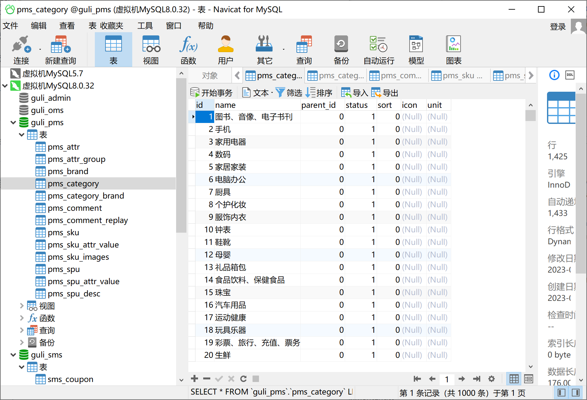

4. 在 **gmall-pms/src/main/java/com/atguigu/gmall/pms/controller** 路径下找到 **CategoryController.java** 新建一个商品分类查询

   CategoryController.java

   ```java
   /*
   * 商品分类查询
   * CategoryEntity 是表 pms_category 的实体类
   * parentId 是请求参数
   * */
   @GetMapping("/parent/{parentId}")
   @ApiOperation("商品分类查询")
   public ResponseVo<List<CategoryEntity>> queryCategoryByParentId(@PathVariable("parentId")Long parentId){
       List<CategoryEntity> categoryEntityList = this.categoryService.categoryParent(parentId);
   
       return ResponseVo.ok(categoryEntityList);
   }
   ```

   在 **gmall-pms/src/main/java/com/atguigu/gmall/pms/service** 包下，接口 `CategoryService` 中新建一个 `categoryParent` 抽象方法

   ```java
   List<CategoryEntity> categoryParent(Long parentId);
   ```

   > IDEA快捷键：Ctrl+h		查看类的层次结构

   在 **gmall-pms/src/main/java/com/atguigu/gmall/pms/service/impl** 找到 `CategoryService` 的实现类 `CategoryServiceImpl` 

   在实现类中实现 `categoryParent` 抽象方法

   ```java
   @Override
   public List<CategoryEntity> categoryParent(Long parentId) {
       QueryWrapper<CategoryEntity> objectQueryWrapper = new QueryWrapper<>();
   	// 如果请求参数不等于-1，则返回查询一级节点
       if (parentId != -1) {
           objectQueryWrapper.eq("parent_id", parentId);
       }
   
       return this.list(objectQueryWrapper);
   }
   ```

## 18.设计数据库表

SPU：Standard Product Unit，标准产品单元，是一组具有共同特征的商品集

SKU：Stock Keeping Unit，库存量单元，因具体特征不同而细分的商品

设计表

按照三范式来设计数据库

**第一范式**（1NF）是指在[关系模型](https://baike.baidu.com/item/关系模型/3189329?fromModule=lemma_inlink)中，对于添加的一个规范要求，所有的域都应该是[原子性](https://baike.baidu.com/item/原子性/7760668?fromModule=lemma_inlink)的，即数据库表的每一列都是[不可分割](https://baike.baidu.com/item/不可分割/56732441?fromModule=lemma_inlink)的原子[数据项](https://baike.baidu.com/item/数据项/3227309?fromModule=lemma_inlink)，而不能是集合，数组，记录等非原子数据项

**第二范式**（2NF）要求数据库表中的每个实例或记录必须可以被唯一地区分

**第三范式**（3NF）要求一个关系中不包含已在其它关系已包含的非主关键字信息

- spu：id name categoryId(分类的ID) brandId(品牌的ID)

- sku：id title(标题) subTitle(副标题) images(图片信息) price(价格) desc(描述信息)

  - pms_attr_group(分组表)：id(分组id) name(组名) category_id(所属分类id)

  - pms_attr(规格参数表)：id name(规格参数名称) search_type(是否是检索类型的规格参数) value_select(可选值列表) type(是否是规格类型的基本参数) show_desc(是否快速展示的规格参数) category_id(所属分类的id，冗余字段) group_id(所属分组的id)
  - pms_spu_attr_value：id spuId(哪个商品的id) attrId(哪个商品的规格参数) attrValue(值是多少)
  - pms_sku_attr_value：id skuId(商品的id) attrId(商品的规格参数) attrValue(值是多少)

数据库性能优化：

- 冗余字段

  在订单表中，‘客户名称’字段就是冗余字段，加了这个字段，就需要在客户信息表修改（客户名称改变）的时候，多做一个更新订单表中‘客户名称’字段的动作。

  这样做的理由是：

  1、订单表的查询速度会提高、一些相关的程序代码实现也简单些，省得老是关联id去找名称，特别在数据量大或者关联表很多的时候会很明显；

  2、客户信息表，作为基本信息，很少改动‘客户名称’，所以虽然多加了一个动作，对性能不会有多大影响。

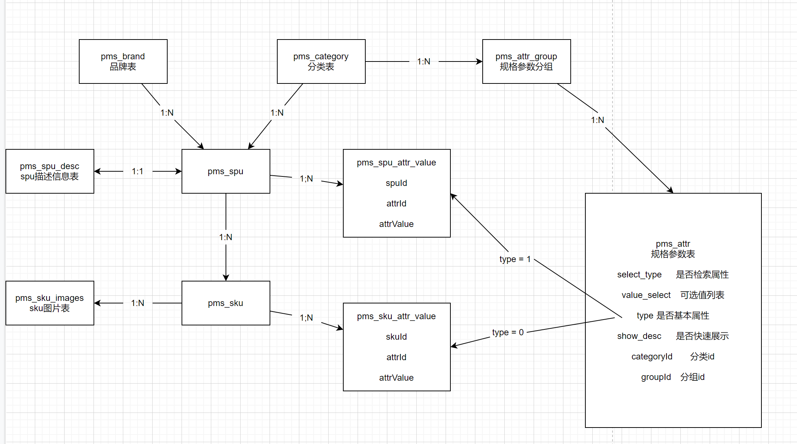

## 19.属性维护

①查询三级分类下的分组

查看请求，发现只有在点击三级分类后才会发送要查分类的属性组

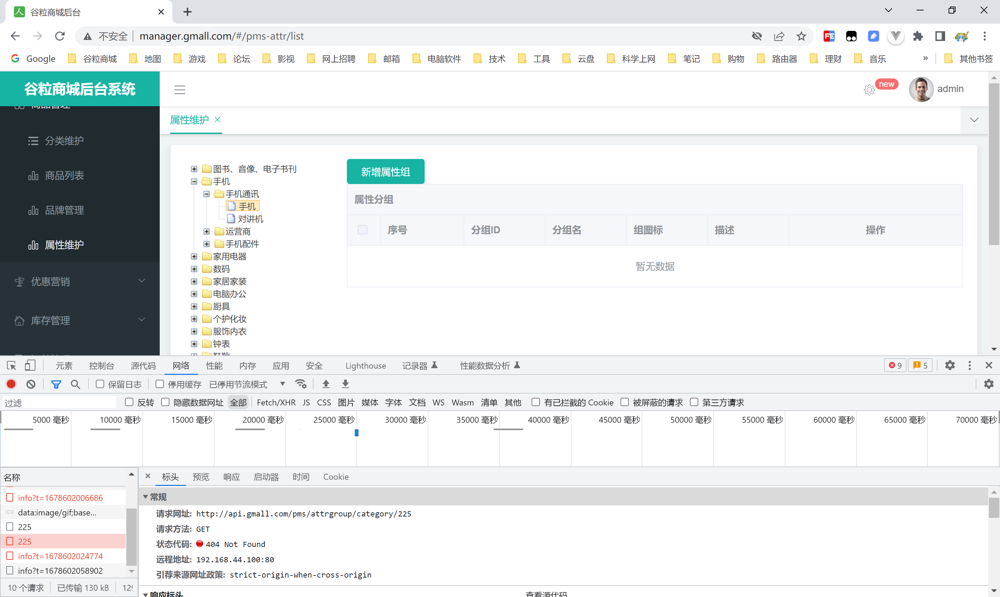

> 请求网址: http://api.gmall.com/pms/attrgroup/category/225
>
> 请求方法: GET

在 **gmall-pms/src/main/java/com/atguigu/gmall/pms/controller** 目录中找到 **AttrGroupController.java** 文件

AttrGroupController.java

```java
/*
* 查询三级分类的分组
* AttrGroupService 接口继承 IService
* 获取到 IService 中的 list 方法
* 传入 queryWrapper 参数
* QueryWrapper()<> 是 MyBatis 中的条件构造器；eq("name","小明") 表示等于 name='小明', ；ne("name","小明"): 表示不等于，即 name='小明' 的数据都不要
* attrGroupEntityList 的输出是json格式
* */
@GetMapping("/category/{cid}")
@ApiOperation("查询三级分类的分组")
public ResponseVo<List<AttrGroupEntity>> queryAttrGroupByCid(@PathVariable("cid")Long cid){
    List<AttrGroupEntity> attrGroupEntityList = this.attrGroupService.list(new QueryWrapper<AttrGroupEntity>().eq("category_id", cid));

    return ResponseVo.ok(attrGroupEntityList);
}
```

②查询组下的规格参数

在查询三级分类下的分组之后，点击属性分组中的维护属性，查看请求

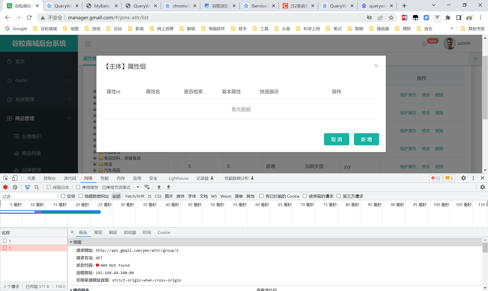

> 请求网址: http://api.gmall.com/pms/attr/group/1
>
> 请求方法: GET

在 **gmall-pms/src/main/java/com/atguigu/gmall/pms/controller** 这个目录中找到 **AttrController.java**

AttrController.java

```java
/*
* 查询组下的规格参数
* */
@GetMapping("/group/{gid}")
@ApiOperation("查询组下的规格参数")
public ResponseVo<List<AttrEntity>> queryAttrByGid(@PathVariable("gid")Long gid){
    List<AttrEntity> attrEntityList = this.attrService.list(new QueryWrapper<AttrEntity>().eq("group_id", gid));

    return ResponseVo.ok(attrEntityList);
}
```

## 20.查询spu列表

在查询spu列表，点击商品管理中的商品列表，查看请求

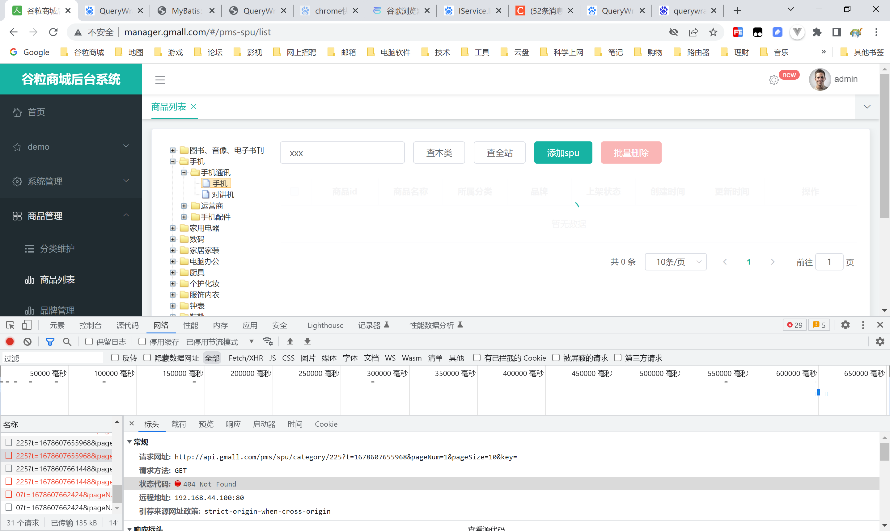

> 请求网址: http://api.gmall.com/pms/spu/category/0?t=1678668817542&pageNum=1&pageSize=10&key=
>
> 请求方法: GET

①在 **gmall-pms/src/main/java/com/atguigu/gmall/pms/controller** 这个目录中找到 **SpuController.java** 

SpuController.java

```java
@GetMapping("/category/{categoryId}")
@ApiOperation("查询spu列表")
public ResponseVo<PageResultVo> queryPageResultVoByCategoryIdPage(@PathVariable("categoryId")Long categoryId,PageParamVo paramVo){
    PageResultVo resultVo=this.spuService.querySpuByCategoryIdPage(categoryId,paramVo);

    return ResponseVo.ok(resultVo);
}
```


②实现 `querySpuByCategoryIdPage` 接口，在 **gmall-pms/src/main/java/com/atguigu/gmall/pms/service** 路径下

实现接口快捷键：Alt + Enter

querySpuByCategoryIdPage

```java
PageResultVo querySpuByCategoryIdPage(Long categoryId, PageParamVo paramVo);
```


③在 **gmall-pms/src/main/resources** 目录下配置 **application.yml** 

application.yml

```yaml
logging:
  level:
    com.atguigu.gmall.pms: debug
```

即可显示输出日志

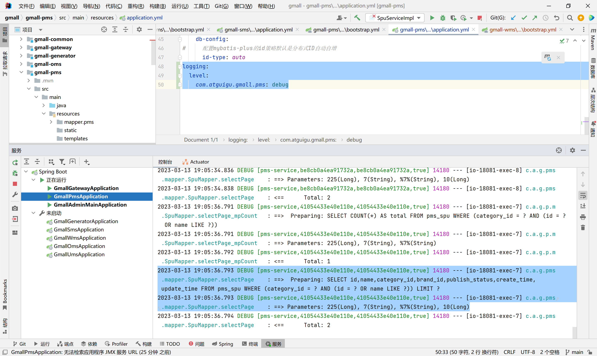


④在实现 `querySpuByCategoryIdPage` 方法，在 **gmall-pms/src/main/java/com/atguigu/gmall/pms/service/impl** 路径下

实现方法快捷键：Alt + Enter

SpuServiceImpl.java

```java
/*
* categoryId 传入品牌id
* this.page 调用了 IService 中的 page(分页条件，查询条件) 分页查询方法
* return PageResultVo(IPage page)
* */
@Override
public PageResultVo querySpuByCategoryIdPage(Long categoryId, PageParamVo paramVo) {
    QueryWrapper<SpuEntity> spuEntityQueryWrapper = new QueryWrapper<>();

    // 查询的sql语句.查本类：select * from pms_spu where category_id='225' AND (id='7'OR name LIKE '%7%');
    // 查询的sql语句.查全站：select * from pms_spu where (id='7'OR name LIKE '%7%');
    // 1.添加查询条件
    if (categoryId != 0) {
        spuEntityQueryWrapper.eq("category_id",categoryId);
    }

    // 2.拿到关键字
    String key = paramVo.getKey();
    // 
    /*
    * StringUtil 选择 com.alibaba.csp.sentinel.util.StringUtil
    * isNotBlank 做了一个空格Whitespace的判断
    * and(函数式接口)
    * 函数式接口类型有以下四中种
    * 消费型函数接口：  有参数没有返回结果集   t ->
    * 供给型函数接口：  没有参数有返回结果集   () -> return
    * 函数型函数接口：  既有参数又有返回结果集   t -> return
    * 断言型函数接口：  有参数有返回结果集，但是返回结果集是 boolean 类型   t -> return boolean
    * */
    if(StringUtil.isNotBlank(key)){
        spuEntityQueryWrapper.and(t ->t.eq("id" , key).or().like("name",key));
    }

    // 翻页查询
    IPage<SpuEntity> page = this.page(
        // 翻页对象
        paramVo.getPage(),
        // 查询条件
        spuEntityQueryWrapper
    );

    return new PageResultVo(page);
}
```

## 21.商品库存

在查询spu的所有sku信息，点击库存管理中的商品库存，查看请求

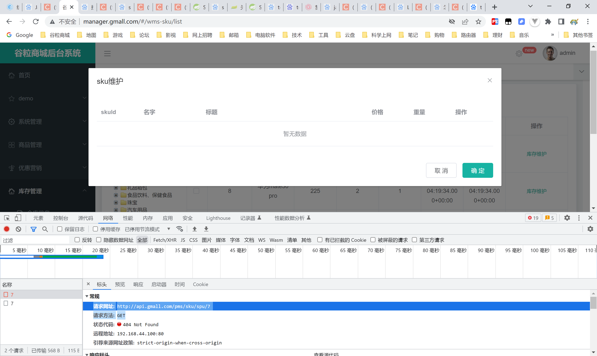

> 请求网址: http://api.gmall.com/pms/sku/spu/7
>
> 请求方法: GET

在 **gmall-pms/src/main/java/com/atguigu/gmall/pms/controller** 目录下找到 **SkuController.java**

SkuController.java

```java
@GetMapping("/spu/{spuId}")
@ApiOperation("查询spu下的所有sku信息")
public ResponseVo<List<SkuEntity>> querySkuBySpuId(@PathVariable("spuId")Long spuId){
    List<SkuEntity> skuEntityList = this.skuService.list(new QueryWrapper<SkuEntity>().eq("spu_id", spuId));

    return ResponseVo.ok(skuEntityList);
}
```

## 22.搭建wms工程

1. gmall-wms/pom.xml

2. 将 `spring-boot-starter-parent` 改成父类依赖 `gmall`

3. 删除 `properties` 标签

4. 引入 `gmall-common` 依赖

5. 引入 `mybatis-plus-boot-starter` 启动器

6. 引入 `spring-cloud-starter-alibaba-nacos-discovery` 依赖

7. 引入 `spring-cloud-starter-alibaba-nacos-config` 依赖

8. 引入 `spring-cloud-starter-alibaba-sentinel` 依赖

9. 引入 `spring-cloud-starter-zipkin` 依赖

10. 将 `mysql-connector-j` 依赖改成 `mysql-connector-java` 依赖，`com.mysql` 改成 `mysql`

11. 删除 `dependencyManagement` 标签

12. 删除 **gmall-wms/src/main/resources/application.properties** 文件

13. 新建 **gmall-wms/src/main/resources/application.yml**

    application.yml

    ```yaml
    server:
      port: 18083
    spring:
      cloud:
        nacos:
          discovery:
            server-addr: localhost:8848
        sentinel:
          transport:
            dashboard: localhost:8080
    #       端口号被占用的情况下，会自动递增
            port: 8719
      zipkin:
        base-url: http://localhost:9411
        discovery-client-enabled: false
        sender:
          type: web
      sleuth:
        sampler:
          probability: 1
    # 可以将数据源放在配置中心，因为开发、测试、运维的环境都不一样，方便更改
      datasource:
        driver-class-name: com.mysql.cj.jdbc.Driver
        url: jdbc:mysql://192.168.44.100:3306/guli_wms
        username: root
        password: MySQL8.0.32
      redis:
        host: 192.168.44.100
        port: 6379
    feign:
      sentinel:
        enabled: true
    mybatis-plus:
      mapper-locations: classpath:mapper/wms/**/*.xml
      type-aliases-package: com.atguigu.gmall.wms.entity
      global-config:
        db-config:
          id-type: auto
    logging:
      level:
        com.atguigu.gmall.pms: debug
    ```

14. 新建 **gmall-wms/src/main/resources/bootstrap.yml**

    bootstrap.yml

    ```yaml
    spring:
      application:
        name: wms-service
      cloud:
        nacos:
          config:
            server-addr: localhost:8848
    #       nacos新建wms命名空间
            namespace: c0ca8dde-f042-44f6-8a85-000d6f6a18db
            group: dev
            file-extension: yml
    ```

15. 将pms中的分页插件 **gmall-pms/src/main/java/com/atguigu/gmall/pms/config/MybatisPlusConfig.java** 复制到 **gmall-wms/src/main/java/com/atguigu/gmall/wms** 中

16. 给启动类 **gmall-wms/src/main/java/com/atguigu/gmall/wms/GmallwmsApplication.java** 添加注解

    ```java
    @EnableDiscoveryClient
    @EnableFeignClients
    @EnableSwagger2
    @MapperScan("com.atguigu.gmall.wms.mapper")
    ```

17. 使用逆向工程生成 `gmall-sms` 代码

    修改配置文件

    ```yaml
    # 文件application.yml
    url: jdbc:mysql://192.168.44.100:3306/guli_sms?useUnicode=true&characterEncoding=UTF-8&useSSL=false
    # 改成
    url: jdbc:mysql://192.168.44.100:3306/guli_wms?useUnicode=true&characterEncoding=UTF-8&useSSL=false
    
    # 文件generator.properties
    ...
    moduleName=sms
    ...
    tablePrefix=sms_
    # 改成
    ...
    moduleName=wms
    ...
    tablePrefix=wms_
    ```

    将生成的代码

    - **guli\main\java\com\atguigu\gmall\wms** 下的包复制到 **gmall-wms/src/main/java/com/atguigu/gmall/wms** 包下

    - **guli\main\resources** 下的 **mapper** 包复制到 **gmall-wms/src/main/resources** 包下

18. 测试连接启动 **GmallSmsApplication** 

    `http://localhost:180823/wms/ware`

## 23.获取某个sku的库存信息

在获取某个sku的库存信息，点击库存管理 -> 商品库存 -> 库存维护 -> 在点击sku维护中的库存维护，查看请求

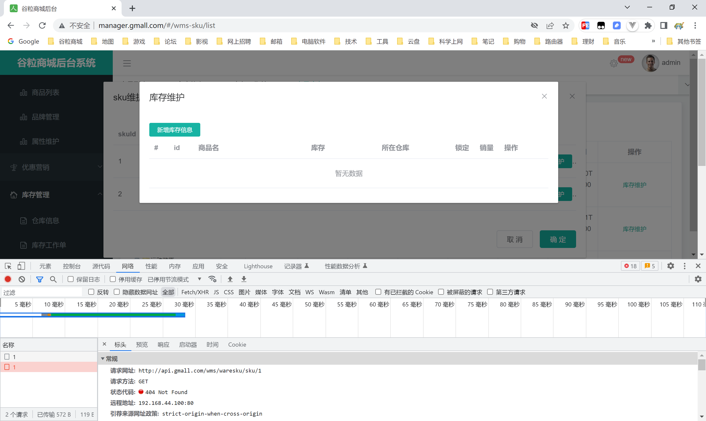

> 请求网址: http://api.gmall.com/wms/waresku/sku/1
>
> 请求方法: GET

在 **gmall-wms/src/main/java/com/atguigu/gmall/wms/controller** 目录下找到 **WareSkuController.java**

WareSkuController.java

```java
@GetMapping("/sku/{skuId}")
@ApiOperation("获取某个sku库存信息")
public ResponseVo<List<WareSkuEntity>> querWartSkuBySkuId(@PathVariable("skuId")Long skuId){
    List<WareSkuEntity> wareSkuEntityList = this.wareSkuService.list(new QueryWrapper<WareSkuEntity>().eq("sku_id", skuId));

    return ResponseVo.ok(wareSkuEntityList);
}
```

点击库存维护，还是没有数据，但是请求以及获取成功了


查看数据库发现表 **wms_ware_sku** 的 **sku_id** 没有为1的数据

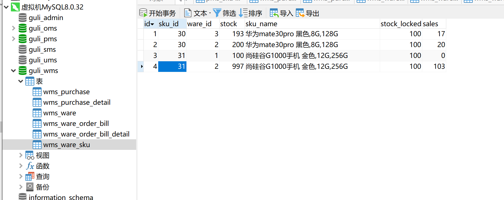

可以修改或添加数据库中的数据来进行查看

## 24.查询分类下的组及规格参数

在查询分类下的组及规格参数，点击商品管理 -> 商品列表中的添加spu -> 录入spu基本信息 -> 商品名称 -> 选择分类（选择到第三级分类时要双击，第一次点击是查看还有没有4级分类，第二次点击选中该分类）

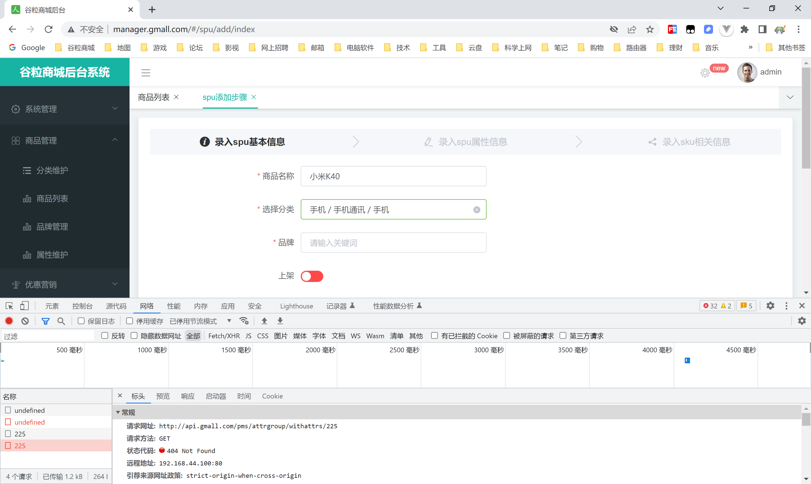

> 请求网址: http://api.gmall.com/pms/attrgroup/withattrs/225
>
> 请求方法: GET


 


## jwt无状态登陆

结构：

1. header头信息
   - token 类型
   - 编码方式
2. payloader载荷
   - 用户信息：用户id 用户名
   - 颁发信息：颁发时间 服务器
3. signature签名
   - RSA （头 + 载荷）

## 搭建并实现授权中心

1. 调用ums的远程接口
2. 如果返回的用户为空，则直接抛出异常
3. 组装载荷：userId username
4. 为了防止盗用：加入了登陆用户的ip地址
5. 生成jwt类型的 token
6. 放入 cookie
7. 把昵称放入 cookie，以便展示登陆状态

## 网关过滤器：

1. 全局过滤器：无差别的拦截所有经过网关的请求，不需要配置

   在 `gateway` 工程中 **application.yml** 进行过滤器配置

   ```yaml
   Spring.
   	predicates:
   		- Host=sso.gamll.com
   ```

   实现 `GlobalFilter` 接口

   在 **gmall-gateway/src/java/com/atguigu/gmall/gateway

   ```java
   ```

   

2. 局部过滤器：拦截特定路由对应服务的请求，需要配置

   1. 编写实现类 `XxxGatewayFilterFactory` 实现 `GatewayFilterFactory` 接口，继承

      ```java
      
      ```

   2. 配置过滤器

      如果要接收固定数量的参数，需要额外实现一下步骤：

   3. 需要自定义实体类 `KeyValueConfig` ,并定义接受指定泛型是上一步定义的实体类

   4. 继承 `AbstractGatewayFilterFactor` 抽象类时，需要指定泛型是上一步定义的实体类

   5. 需要重写父类的无参构造方法，调用 `super(KeyValueConfig.class)`

   6. 重写父类的 `shortcutFieldOrder` 方法，指定接受参数的字段顺序

      如果接收不定数量的参数，需要额外实现以下步骤

      1. 判断当前请求路径在不在拦截名单之中，不在则直接放行
      2. 获取登陆用户的token（头信息 cookie）
      3. 对 token 判空，如果为空则直接重定向到登陆页面，请求结束
      4. 使用用公钥解析 jwt 类型的token，如果出现异常直接重定向到登陆页面，请求结束
      5. 验证请求用户的ip地址和登陆用户的ip地址是否一致，不一致则直接重定向到登陆页，请求结束
      6. 严重请求用户的ip地址（userId username）
      7. 放行

## 购物车

数据模型：读多写多

1. 数据模型：

   id userId skuId defaultImage title saleAttr price count store sales check

2. 存储方案：

   1. 浏览器端存储
      - cookie：长度限制，每天默认携带cokeie
      - localhtorge indxDB WebsQl
   2. redis：
      - redis：性能高，大小限制，不利于数据分析
      - mysql：性能差，数据量较大，利于数据库分析
      - redis（主 同步 写操作或下单 读） + mysql（辅 异步 只能数据分析）
      - redis 的数据量不会随时间推移而增多，只会随用户量的增长而变多
   3. mysql：一张表
   4. redis：五种数据模型 `key = userId(登陆状态)/userKey(uuid未登陆状态)` `field-skuId` `value-cartJsons` 
      - string：Map<String, String>
      - list：Map<String, List<String>>
      - Set：Map<String, Set<String>>
      - hash：Map<String, Map<String, String>>
      - zset

3. 分析功能实现：

   新增：

   1. 判断登陆状态：登陆-userId	未登陆-userKey
   2. 判断当前用户的购物车是否包含该商品：
      - 包含-累加数量
      - 不包含-新增记录

   查询：

   1. 判断登陆状态：登陆-userId	未登录-userKey
   2. 如果未登陆则直接以 userKey 查询未登陆的购物车并返回即可
      - 如果现在是登陆状态
      - 先判断是否存在未登录的购物车
      - 如果存在，则合并到己登陆的购物车中去
      - 然后清空未登陆的购物车，最后返回合并的购物车

   更新：

   1. 判断登陆状态：登陆-userId	未登录-userKey
   2. 可以根据 skuId 获取购物车对象，进而更新数量或者选中状态即可

   删除：

   1. 判断登陆状态：登陆-userId	未登录-userKey
   2. 删除对应的购物车记录（skuId）

## 拦截器

拦截器和过滤器（网关 servlet）区别？

- *实现原理不同*

  - 过滤器和拦截器底层实现方式大不相同，过滤器 是基于函数回调的，拦截器 则是基于Java的反射机制（动态代理）实现的。

- *使用范围不同*

  - 我们看到过滤器 实现的是 javax.servlet.Filter 接口，而这个接口是在Servlet规范中定义的，也就是说过滤器Filter 的使用要依赖于Tomcat等容器，导致它只能在web程序中使用。 而拦截器(Interceptor) 它是一个Spring组件，并由Spring容器管理，并不依赖Tomcat等容器，是可以单独使用的。不仅能应用在web程序中，也可以用于Application、Swing等程序中。

- *触发时机不同*

  - 过滤器Filter是在请求进入容器后，但在进入servlet之前进行预处理，请求结束是在servlet处理完以后。拦截器 Interceptor 是在请求进入servlet后，在进入Controller之前进行预处理的，Controller 中渲染了对应的视图之后请求结束。

- *拦截的请求范围不同*

  - 过滤器Filter执行了两次，拦截器Interceptor只执行了一次。这是因为过滤器几乎可以对所有进入容器的请求起作用，而拦截器只会对Controller中请求或访问static目录下的资源请求起作用。

- *注入Bean情况不同*

  - 这是因为加载顺序导致的问题，拦截器加载的时间点在springcontext之前，而Bean又是由spring进行管理。

- *控制执行顺序不同*

  - 过滤器用@Order注解控制执行顺序，通过@Order控制过滤器的级别，值越小级别越高越先执行。 拦截器默认的执行顺序，就是它的注册顺序，也可以通过Order手动设置控制，值越小越先执行

  Filter的执行顺序在Interceptor之前，具体的流程见下图
  

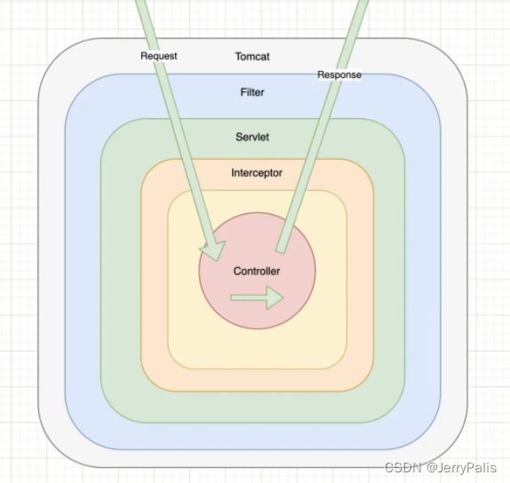

怎么实现拦截器？

1. 编写实现类实现HandlerInterceptor接口

   - preHandle：前置方法，在Handler执行之前执行
   - postHande：后置方法，在Handler执行之后执行
   - afterCompletion：完成方法，在试图渲染完成之后执行

2. 配置拦截器：

   ```java
   // spring中配置
   <mvc:interceptors>
   	<mvc:interceptor>
   		<mvc:mapping path="/**" />
   		<bean class="自定义拦截器的全路径">
   	</mvc:interceptor>
   </mvc:interceptors>
   
   /* 
   * springBoot中配置
   * 在config包下新建一个MvcConfig.java
   * 实现 WebMvcConfigurer 接口
   */
   ```

3. 怎么传递参数给后续业务

   - 全局变量：线程安全问题，很多时候线程安全问题无法解决，只能避免

     - 单例模式

     - 非 final 状态字段

       只要以上两种情况不要同时出现

   - request对象
   - ThreadLocal
     - Thread --> ThreadLocalMap<WeakReferenche<ThreadLocal>,载荷对象>

## 本地异步和分布式异步

分布式异步：MQ，跨服务，性能稍低，可靠性高

本地异步：多线程，服务内，性能高

